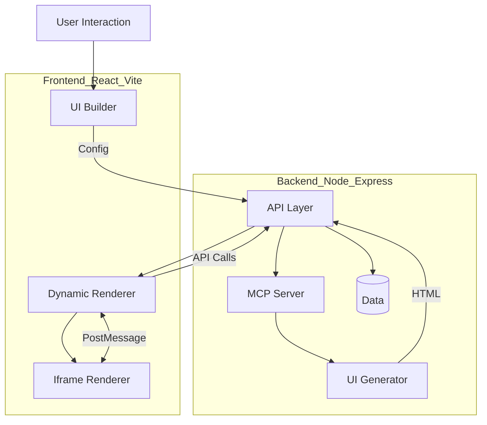

# 👋 Hi, I'm Aditya Raj

### 💻 Software Development Engineer | Frontend Specialist | React Ecosystem Expert

  

---

## 🚀 About Me

I'm a **Software Development Engineer with ~4.5 years of experience** building scalable, high-performance systems.

- ⚡ Currently at **Cashfree Payments** — working on **risk & fraud systems**
- 📊 Systems handling **millions of transactions/month**
- 🧠 Reduced SLA breaches from **70% → 15%**
- 🏗️ Built **real-time rule engine for fraud detection**
- 🌍 Experience across **Fintech, Healthcare, Travel**

---

## 🧠 Engineering Mindset

> Build fast. Scale clean. Break nothing.

- ⚡ Performance-first (Core Web Vitals, Lighthouse)
- 🧩 Scalable architecture & clean abstractions
- 🔄 Developer Experience (DX) focused
- 🤖 Exploring AI-native development systems

---

## 🛠️ Tech Stack

### **Frontend**

### **Backend**

---

## 🚀 Featured Projects

### 🧠 Dynamic UI Generator (MCP UI PoC)

A **full-stack system for generating dynamic UI components in real-time** using schema-driven architecture and sandboxed rendering.

---

### 🏗️ Architecture

---

### 🧠 Key Design Decisions

- **Iframe isolation** → safe execution of dynamic UI  
- **Schema-driven rendering** → flexible UI generation  
- **PostMessage bridge** → real-time communication  
- **Backend-driven UI** → no redeploy for UI updates  

---

### 🧠 How It Works Internally

The system follows a schema-driven pipeline where user input is sent to a backend service that generates UI definitions. These definitions are rendered inside an isolated iframe, and a PostMessage bridge enables communication between the rendered UI and the main React app, enabling real-time interaction without redeployment.

---

### 🔗 Links

- GitHub: https://github.com/iamadi11/mcp-ui-poc

---

### 🎯 Mouse Follow (UI Experiment)

A lightweight project exploring **interactive cursor-based animations**

- GitHub: https://github.com/iamadi11/mouse-follow  
- Live: https://mouse-follow-nine.vercel.app/

---

## 🧩 Problems I Solved

### ⚡ Dynamic UI Generation
- Problem: UI changes require deployments  
- Solution: Schema-driven system  
- Impact: Faster iteration  

---

### 📉 SLA Breach Reduction
- Problem: High SLA violations (~70%)  
- Solution: Real-time processing system  
- Impact: Reduced to ~15%  

---

### ⚡ Frontend Performance
- Problem: Slow load times  
- Solution: Optimization techniques  
- Impact: Better UX  

---

## 📈 GitHub Stats

  
  
  

---

## 🤖 Currently Exploring

- AI-powered dev systems (MCP, Cursor)
- Code automation & intelligent tooling
- Frontend architecture at scale

---

## 🌐 Connect With Me

  
  
  

---

## ⚡ Fun Fact

I like building systems that **scale silently but impact massively** 🚀
